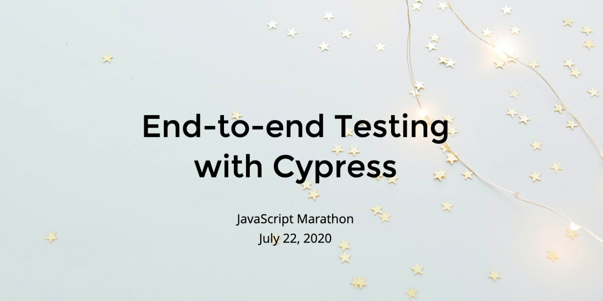

# testing-workshop-cypress

> A 1-hour version of the cypress-testing-workshop for [Cypress.io](https://www.cypress.io/) built for JS Marathon

## Requirements ⚙️

- Any computer: Mac, Windows, Linux
- [Node 8+](https://nodejs.org/)
- [git](https://git-scm.com)

In order to get the code and install dependencies

```bash
git clone git@github.com:cypress-io/testing-workshop-cypress.git
cd testing-workshop-cypress
git fetch
git checkout js-marathon
npm install
```

If necessary, install dependencies inside TodoMVC folder

```bash
cd todomvc
npm install
```

### Quick check ✅

You can test the installation by starting TodoMVC in the first terminal window

```shell
npm start
```

and you should see in the terminal

```text
> json-server --static . data.json --middlewares ./node_modules/json-server-reset


  \{^_^}/ hi!

  Loading data.json
  Loading ./node_modules/json-server-reset
  Done

  Resources
  http://localhost:3000/todos

  Home
  http://localhost:3000
```

From the second terminal window you should be able to open Cypress in the root of the project with

```bash
$ npm run cy:open

> testing-workshop-cypress@1.0.0 cy:open /git/testing-workshop-cypress
> cypress open
```

### Tip

You can use the installed [start-server-and-test](https://github.com/bahmutov/start-server-and-test) utility to start the app, open Cypress and then shutdown the app when you exit Cypress.

```bash
$ npm run dev
```

## Application 💾

[Vue.js](https://vuejs.org/) + [Vuex](https://vuex.vuejs.org/) + REST server application that we are going to test is in the folder `todomvc`. This application and its full testing is described in [this blog post](https://www.cypress.io/blog/2017/11/28/testing-vue-web-application-with-vuex-data-store-and-rest-backend/). The application should run fine without network access.

## Slides 🖥

[JavaScript Marathon: End-to-end Testing with Cypress](https://cypress.slides.com/cecelia/end-to-end-testing-with-cypress)



## Reset Database

Every time a new Todo is saved or deleted, it changes file `todomvc/data.json`. To reset the list back to empty run `npm run reset` command.

## Questions?

Any questions or issues **specific to the JS Marathon branch** should come to me, Cecelia! You can contact me on Twitter [@ceceliacreates](http://www.twitter.com/ceceliacreates)

If you have an issue with the **testing-workshop-cypress** repo, please [create an issue](https://github.com/cypress-io/testing-workshop-cypress/issues/new).
